## ДЗ 3.5 Файловые системы Ворсин Денис

### 1. Узнайте о sparse (разряженных) файлах.

        Разрежённый файл (англ. sparse file) — файл, в котором последовательности нулевых байтов заменены на информацию об этих последовательностях (список дыр).
        Дыра (англ. hole) — последовательность нулевых байт внутри файла, не записанная на диск. Информация о дырах (смещение от начала файла в байтах и количество байт) хранится в метаданных ФС. 

### 2. Могут ли файлы, являющиеся жесткой ссылкой на один объект, иметь разные права доступа и владельца? Почему?

        Файлы, являющиеся жесткой ссылкой на один обьект не могут иметь разные права доступа и владельца, т.к. это один по сути 1 файл.
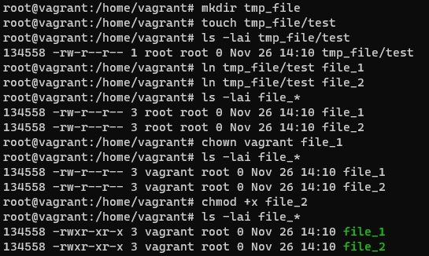

### 3. Сделайте vagrant destroy на имеющийся инстанс Ubuntu. Замените содержимое Vagrantfile следующим:

        виртуальная машина с нужными дисками создана.
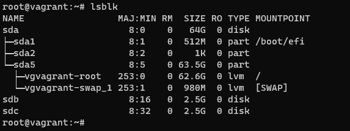

### 4. Используя fdisk, разбейте первый диск на 2 раздела: 2 Гб, оставшееся пространство.

### 5. Используя sfdisk, перенесите данную таблицу разделов на второй диск.

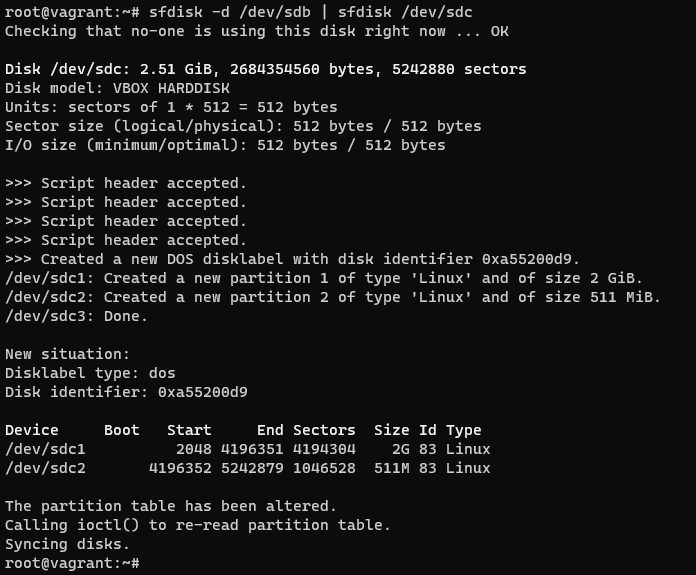

### 6. Соберите mdadm RAID1 на паре разделов 2 Гб.

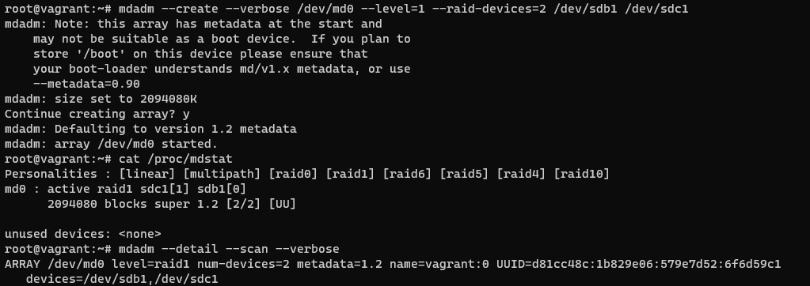

### 7. Соберите mdadm RAID0 на второй паре маленьких разделов.

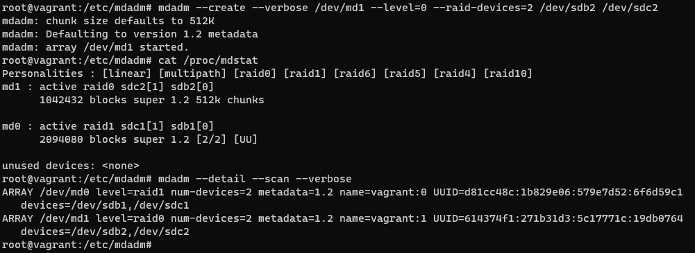

### 8. Создайте 2 независимых PV на получившихся md-устройствах.

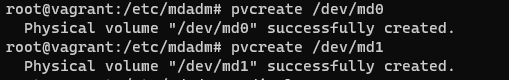

### 9. Создайте общую volume-group на этих двух PV.

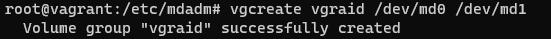

### 10. Создайте LV размером 100 Мб, указав его расположение на PV с RAID0.

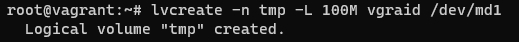

### 11. Создайте mkfs.ext4 ФС на получившемся LV.

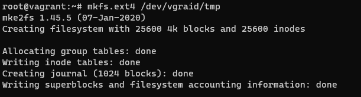

### 12. Смонтируйте этот раздел в любую директорию, например, /tmp/new.

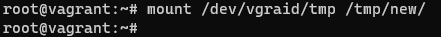

### 13. Поместите туда тестовый файл, например wget https://mirror.yandex.ru/ubuntu/ls-lR.gz -O /tmp/new/test.gz.

### 14. Прикрепите вывод lsblk.

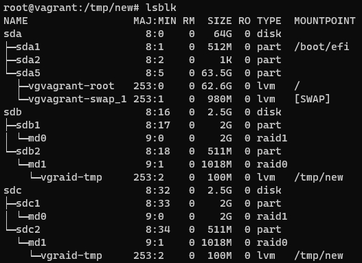

### 15. Протестируйте целостность файла:

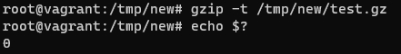

### 16. Используя pvmove, переместите содержимое PV с RAID0 на RAID1.

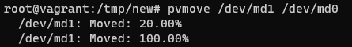

        диски переехали:

### 17. Сделайте --fail на устройство в вашем RAID1 md.

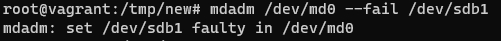

### 18. Подтвердите выводом dmesg, что RAID1 работает в деградированном состоянии.

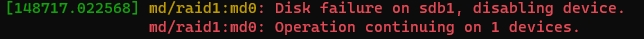

### 19. Протестируйте целостность файла, несмотря на "сбойный" диск он должен продолжать быть доступен:

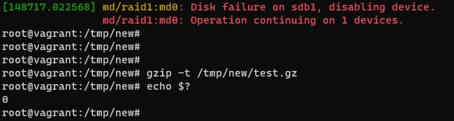

