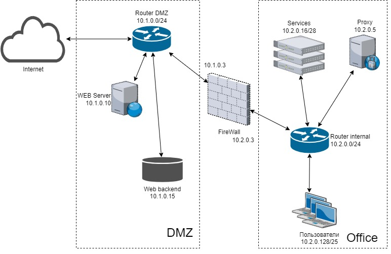

## ДЗ 3.8. Компьютерные сети, лекция 3 Ворсин Денис

### 1. Подключитесь к публичному маршрутизатору в интернет. Найдите маршрут к вашему публичному IP

    
### 2. Создайте dummy0 интерфейс в Ubuntu. Добавьте несколько статических маршрутов. Проверьте таблицу маршрутизации.

    
### 3. Проверьте открытые TCP порты в Ubuntu, какие протоколы и приложения используют эти порты? Приведите несколько примеров.

        Приложение Netdata c PID 827 слушает на порту 19999 по протоколу tcp с любого сетевого интерфейса.
        Приложение Netdata c PID 827 слушает на порту 8125 по протоколу tcp только с локального хоста.
        Приложение node_exporter c PID 634 слушает на порту 29100 по протоколу tcp с любого сетевого интерфейса.

### 4. Проверьте используемые UDP сокеты в Ubuntu, какие протоколы и приложения используют эти порты?

        Приложение systemd-resolved c PID 567 слушает на порту 53 по протоколу udp только с локального хоста.
        Приложение Netdata c PID 827 слушает на порту 8125 по протоколу udp только с локального хоста.

### 5. Используя diagrams.net, создайте L3 диаграмму вашей домашней сети или любой другой сети, с которой вы работали.

