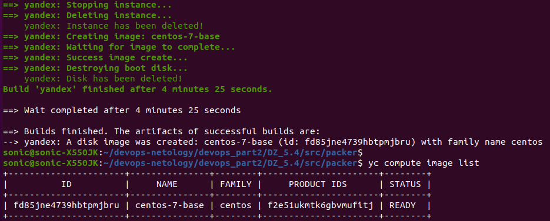
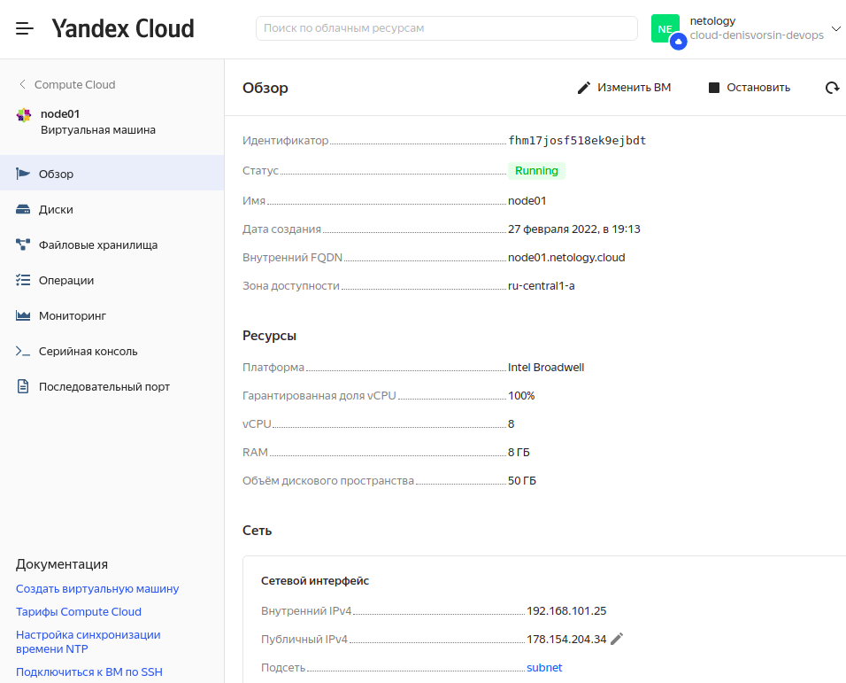
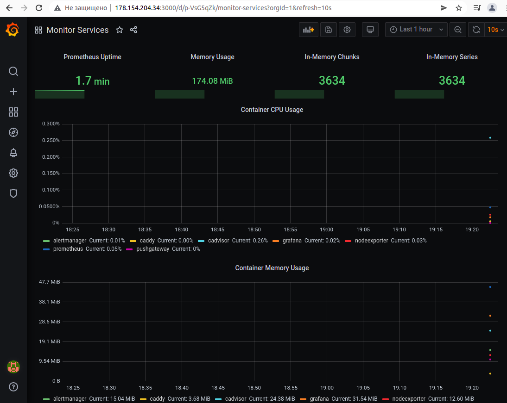

# ДЗ 5.4. Оркестрация группой Docker контейнеров на примере Docker Compose. Ворсин Денис

## Задача 1
Создать собственный образ операционной системы с помощью Packer.

Образ создан:

## Задача 2

Создать вашу первую виртуальную машину в Яндекс.Облаке.

Виртуальная машина создана:

## Задача 3

Создать ваш первый готовый к боевой эксплуатации компонент мониторинга, состоящий из стека микросервисов.

Компоненты мониторинга запущены:

