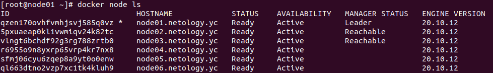
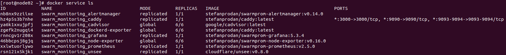

# ДЗ 5.5. Оркестрация кластером Docker контейнеров на примере Docker Swarm. Ворсин Денис

## Задача 1

Дайте письменные ответы на следующие вопросы:

- В чём отличие режимов работы сервисов в Docker Swarm кластере: replication и global?
- Какой алгоритм выбора лидера используется в Docker Swarm кластере?
- Что такое Overlay Network?

Ответ: 
```
1. В чём отличие режимов работы сервисов в Docker Swarm кластере: replication и global?
в режиме replication указывается количество копий сервиса, которые докер распределяет по нодам
в режиме global количество копий сервиса не указывается, но копия сервиса запускается на каждой ноде.

2. Какой алгоритм выбора лидера используется в Docker Swarm кластере?
для выбора лидера используется алгоритм raft.

3. Что такое Overlay Network?
виртуальная сеть поверх обычной сети для взаимодействия приложений в докере. 
для туннелирования оверлейной сети между нодами используется vxlan.
```

## Задача 2

Создать ваш первый Docker Swarm кластер в Яндекс.Облаке

Кластер в Яндекс.Облаке создан:



## Задача 3

Создать ваш первый, готовый к боевой эксплуатации кластер мониторинга, состоящий из стека микросервисов.

Кластер мониторинга запущен:



## Задача 4
Выполнить на лидере Docker Swarm кластера команду (указанную ниже) и 
дать письменное описание её функционала, что она делает и зачем она нужна:
```
docker swarm update --autolock=true
```

Ответ:
```
Для работы менеджеров используются Raft логи, они зашифрованы и для работы с ними используются TLS ключи.
Для защиты этих TLS-ключей можно использовать механизм autolock, в этом случае будет выдан ключь-пароль, 
который потребуется каждый раз после рестарта менеджера для его разблокировки.
```
